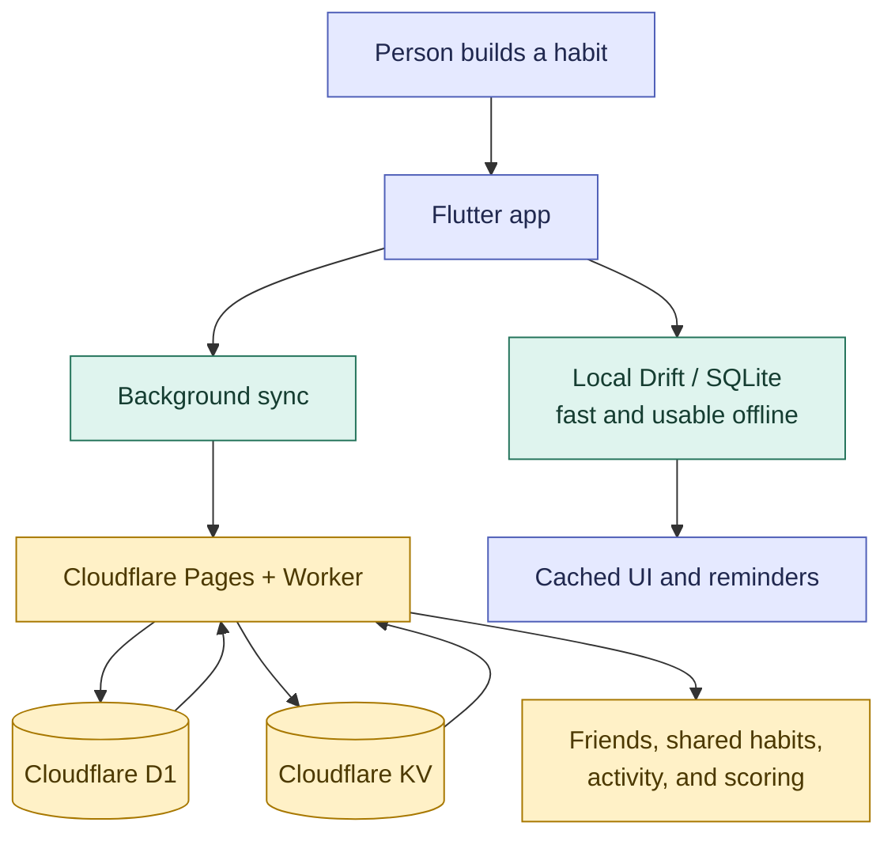

# Hable

<p align="center">
  
</p>

<p align="center"><strong>Warm, offline-first habit building with accountability.</strong></p>

Hable is an offline-first habit tracker for building consistent routines with a little more warmth and accountability. It combines a Flutter client, local Drift storage, background synchronization, and a Cloudflare Pages/Worker backend for accounts and social features.

[](https://hable.pages.dev)
[](#availability)
[](#availability)
[](https://hable.pages.dev)
[](#contributors)
[](#ai-authorship)
[](#ai-authorship)

## Availability

Hable is currently available as an Android app, a macOS app, and a web app at
[hable.pages.dev](https://hable.pages.dev).

## Contributors

Thanks to the people who have contributed to Hable:

[](https://github.com/ettefagh)
[](https://github.com/AbdulMuhaiminKhan)
[](https://github.com/EmilGabibov)
[](https://github.com/NabielImtiyaz)

## AI authorship

This repository is coded by an AI agent. The code is not human-supervised;
reviewers should validate behavior, security, dependencies, and deployment
configuration before using it in production.

## Hable at a glance



Hable is local-first: the app can record and display habit activity without a
network connection, while the backend remains authoritative for synchronized
social state and scoring.

## What it includes

- Offline-first habit tracking with local SQLite/Drift persistence.
- Background sync to Cloudflare D1 with server-owned scoring.
- Shared habits, friendships, nudges, activity, and a friends-only leaderboard.
- Local inverted-index search for project and app content.
- Responsive Flutter targets for Android, iOS, macOS, Windows, Linux, and web.
- Localization for English, German, Farsi, Russian, Tamil, and Urdu.
- Accessibility-minded interaction states, recovery paths, and automated tests.

## Architecture

```text
Flutter UI
  ├─ Riverpod providers and services
  ├─ Drift / SQLite local database
  └─ background sync and notifications
          │
          ▼
Cloudflare Pages + Worker (Hono)
  ├─ authentication and profile APIs
  ├─ habit, friendship, and social sync
  ├─ server-owned score and achievement rules
  ├─ D1 relational database
  └─ KV for short-lived social state
```

The client remains usable while offline. The backend is the authority for synchronized social state and scoring; the client renders cached server results.

## Repository layout

| Path | Purpose |
| --- | --- |
| `lib/` | Flutter application, providers, services, database, and widgets |
| `test/` | Flutter unit and widget tests |
| `backend/` | Cloudflare Pages Functions, D1 schema, and deployment scripts |
| `e2e/` | Playwright browser and accessibility tests |
| `Developement/` | Architecture, QA, release, and product documentation |
| `.github/` | CI, issue templates, pull request guidance, and dependency automation |

Local review artifacts, generated exports, UI dumps, and machine-specific
files are ignored. The repository keeps `Developement/` published because it
contains the architecture and issue-engineering contract. See
[`Developement/issue_engineering.md`](Developement/issue_engineering.md) for a
visual guide to the workflow.

## Getting started

### Prerequisites

- Flutter SDK compatible with the Dart constraint in `pubspec.yaml`.
- Node.js and npm for the backend and Playwright tests.
- Wrangler for local Cloudflare development and deployment.
- Doppler or another approved secret-management workflow for deployed secrets.

### Install and run the Flutter app

```bash
flutter pub get
flutter run
```

Generate localization and provider/database code when needed:

```bash
flutter gen-l10n
flutter pub run build_runner build --delete-conflicting-outputs
```

### Run the backend locally

```bash
cd backend
npm ci
npm run setup:doppler
npm run dev
```

Do not commit `.env` files, API tokens, database credentials, or production bindings. See [CONTRIBUTING.md](CONTRIBUTING.md) and [SECURITY.md](SECURITY.md).

## Verification

```bash
flutter analyze
flutter test

cd backend
npm ci
npx tsc --noEmit
npm run smoke:regression
```

Browser tests require a running target and the environment described by the Playwright configuration:

```bash
cd e2e
npm ci
npm test
```

## Deployment

The production web deployment is Pages-based. Review `backend/wrangler.toml` and the operator commands in [`Developement/commands.md`](Developement/commands.md) before deploying. Deployment requires access to the configured Cloudflare account, D1 database, KV namespace, service binding, and secret store.

## Documentation

- [Development timeline](Developement/project_development_timeline.md)
- [System architecture](Developement/sys_offline_architecture.md)
- [Authentication contract](Developement/sys_authentication.md)
- [Social and analytics contract](Developement/sys_social_and_analytics.md)
- [QA guide](Developement/qa_testing.md)
- [Release preparation checklist](Developement/Publishment/PreprationChecklist.md)
- [Issue engineering workflow](Developement/issue_engineering.md)
- [Contributing](CONTRIBUTING.md)
- [Security](SECURITY.md)

## Project status

Hable is an actively developed project. APIs, data contracts, and supported distribution targets may change while the release surface is being hardened. Check the issue tracker and the development documentation before building integrations on top of the backend.

## License

No open-source license has been declared yet. Until a license is added by the copyright holder, the source is available for inspection but should not be assumed to be reusable, redistributed, or modified outside the permissions granted by applicable law.
